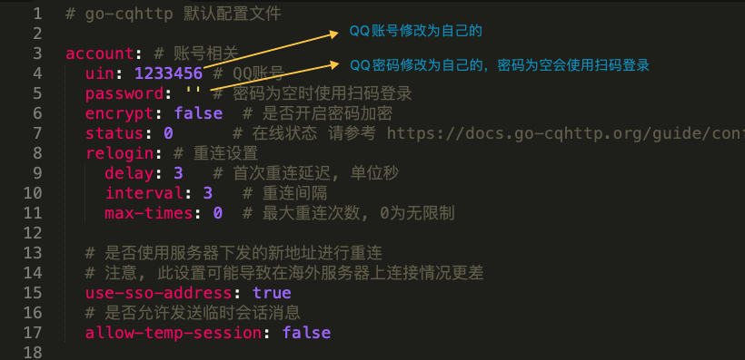
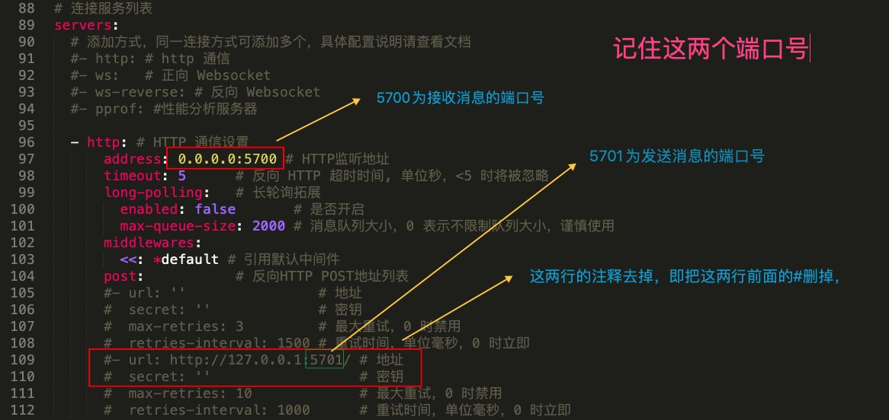

# qqbot 说明文档

本项目基于go-cqhttp框架以及nginx服务，为QQ防撤回消息提供一种技术解决方案。  

## 项目简介

***项目功能***：保存QQ好友发送的文本消息、图片消息、文件至云端，同时将其发送至另一QQ好友，方便实时获取消息。  

***项目版本***：1.0.0  

***项目技术框架***：go-cqhttp(v1.0.0-rc4)、nginx(1.21.5)  

***项目部署服务器***：CentOs 7.x（其他服务器自行部署）

***项目语言***：python  

## 项目结构说明
***images***：好友发送的图片存储位置  
***files***：好友发送的文件（包括视频）存储位置  
***allfiles***：类似于日志文件，存储图片以及文件的基本信息  
***config.ini***：项目配置文件，配置详情见后文    
***logger.log***：日志文件  
***loggertool***：日志处理工具  
***main.py***：项目入口程序  
***qqapi.py***：功能实现核心api    
***README.md***：项目说明文档  


## 项目部署指南  

首先，本项目基于go-cqhttp以及nginx，需要先对go-cqhttp以及nginx进行配置。  

***go-cqhttp的官网***   

<https://docs.go-cqhttp.org>  

下载文件解压后执行下述命令：  

    

修改配置文件config.yml：  

   
  

至此go-cqhttp服务配置完毕。

***nginx的官网***  

<http://nginx.org/>  

在nginx的配置文件nginx.conf中，添加一个代理：    

   

nginx配置完毕。  

配置好go-cqhttp以及nginx之后，再来配置项目。

### 拉取项目

首先使用***git***命令拉取项目文件：  

`git clone https://github.com/ly-sixibiheye/qqbot.git`  

### 项目配置
接着修改配置项目文件中，配置文件为***config.ini***。  

```ini
[server]
# 为实时看到QQ消息，项目将消息统一转达给另一QQ号，此处可修改为自己的小号
my_qq = 12345678

# 部署的服务器的公网IP，修改为自己服务器的公网IP
server_ip = 127.0.0.1

# 本地IP，一般不作修改
local_ip = 127.0.0.1

# go-cqhttp服务接收消息的端口，与go-cqhttp的配置文件保持一致
receive_server_port = 5700

# go-cqhttp服务发送消息的端口，与go-cqhttp的配置文件保持一致
send_server_port = 5701

[nginx]
# nginx服务开放的端口，与nginx配置文件设置的端口保持一致
nginx_port = 8888


[logger]
# 日志文件名，自行设置
handler_file_name = logger.log

# 日志文件输出级别，自行设置
file_handler_level = DEBUG

# 控制台日志输出级别，自行设置
stream_handler_level = DEBUG

```  

配置完成后，在服务器上，依次运行命令：  

1. nohup go-cqhttp > /dev/null &
2. nginx
3. nohup python ./main.py > ./message.txt &  

命令中日志存储文件路径可自行设置，注意main.py启动文件的路径。

至此项目部署完毕。


